# Adaptive Agentic RAG Engine

*(developed under the working name "ContextGuard" — folder/package names below still reflect that)*

## What it does

A domain-independent, multi-tenant RAG system. Authenticated users create isolated
workspaces, upload documents (PDF/DOCX/PPTX/Markdown/HTML), and ask questions against them.
Every query runs deterministic hybrid retrieval first; a bounded LangGraph agent only kicks in
when that first pass looks incomplete. Answers are grounded, cited back to real source chunks,
and passed through a lightweight post-generation verifier before being shown to the user.

## Why it exists

Most RAG systems either always do naive top-k retrieval (misses multi-part/multi-document
questions) or always run a full agent loop (slow, expensive, unnecessary for 80% of real
questions). The engineering bet here: **retrieval should escalate only when it needs to.**
A deterministic hybrid+rerank pass handles simple, single-hop questions cheaply; a
hard-bounded retrieval agent (max 3 iterations, 5 retrieval calls, 15 evidence chunks — never
unbounded) activates only when the assessor judges evidence insufficient. Phase 7's own
evaluation found this escalation currently never fires *without a configured assessor LLM* —
reported honestly in [Evaluation](#evaluation), not hidden.

## Core capabilities

- Workspace-isolated multi-tenant auth (HttpOnly JWT cookies, server-side authorization)
- Async structured ingestion: Docling parsing + HybridChunker → dense (BAAI/bge-small-en-v1.5)
  + sparse (Qdrant/bm25) embeddings → Qdrant, via a Redis/RQ worker
- Hybrid retrieval (dense + sparse + RRF fusion) with cross-encoder reranking
  (Xenova/ms-marco-MiniLM-L-6-v2)
- Bounded adaptive retrieval agent (LangGraph) — one agent, hard iteration/call/evidence caps,
  operational trace only (no chain-of-thought ever stored or exposed)
- Grounded generation with backend-resolved `[Sn]` citations (LLM never invents citation IDs —
  any ID not in the backend's own evidence map is discarded before reaching the client)
- Post-generation verifier: `SUPPORTED | PARTIALLY_SUPPORTED | UNSUPPORTED | UNAVAILABLE`,
  with one bounded correction + re-verification pass; an unreachable verifier is **never**
  displayed as "Verified"
- Production Docker (shared backend/worker image, CPU-only PyTorch), local/S3 storage
  abstraction, CI, deployment config

## Architecture

```mermaid
flowchart TD
    subgraph Upload
        U1[Browser] --> U2[Next.js /api proxy]
        U2 --> U3[FastAPI]
        U3 --> U4[(Storage: local or S3)]
        U3 --> U5[(Postgres: QUEUED)]
        U3 --> U6[Redis / RQ]
        U6 --> U7[Worker]
        U7 --> U8[Docling parse + HybridChunker]
        U8 --> U9[Dense + sparse embeddings]
        U9 --> U10[(Qdrant)]
        U7 --> U11[(Postgres: READY)]
    end
    subgraph Query
        Q1[Browser] --> Q2[Next.js /api proxy]
        Q2 --> Q3[FastAPI — workspace_id verified]
        Q3 --> Q4[HYBRID_RERANK: dense+sparse → RRF → cross-encoder]
        Q4 --> Q5{Evidence sufficient?}
        Q5 -->|yes| Q7[Grounded generation]
        Q5 -->|no, bounded| Q6[LangGraph retrieval loop\nmax 3 iter / 5 calls / 15 chunks]
        Q6 --> Q7
        Q7 --> Q8[Citation extraction\nbackend id_map only]
        Q8 --> Q9[Verifier: SUPPORTED/PARTIAL/UNSUPPORTED/UNAVAILABLE]
        Q9 --> Q10[Answer + citations + trace + verification]
    end
```



## Adaptive behavior

Every query first runs deterministic `HYBRID_RERANK`. A heuristic (or, with `GROQ_API_KEY`
configured, LLM) assessor judges the evidence: `ANSWER_NOW` → generate immediately;
`RETRIEVE_MORE` → the LangGraph agent plans focused follow-up queries and retries, bounded by
hard caps; `ABSTAIN` → pack empty evidence, generation honestly says it doesn't know. The
`workspace_id` is set once by the authenticated API layer and threaded through the graph as an
immutable field — the LLM/planner never sees it and cannot influence retrieval scope, so
document content (even adversarial content) cannot escalate a query into a different
workspace's data.

## Security

- Server-side workspace authorization on every request — never delegated to the LLM
- Every Qdrant retrieval call is filtered by authenticated `workspace_id` at the datastore
  layer, not just at the application layer
- The model/agent never controls or sees `workspace_id`; it cannot be redirected by prompt
  injection embedded in document content
- Retrieved document text is treated as untrusted data in every prompt (verifier and
  generator both frame it explicitly as non-instructional) — covered by a dedicated
  prompt-injection-in-evidence test case, passing
- Citation IDs are backend-owned: any ID the LLM emits that isn't in the backend's own
  evidence map is discarded before it ever reaches the client or the verifier
- Bounded tool access: the retrieval agent can only call the same authorized `retrieve()`
  function the deterministic path uses — no filesystem, shell, or arbitrary-URL access
- Uploaded originals are private: local storage isn't web-served, and the production S3 path
  uses no public ACLs or public URLs — the frontend only ever sees API-served metadata/snippets
- HttpOnly, `Secure` (in production), `SameSite` cookies — JWTs are never put in
  `localStorage`; production config also adds `TrustedHostMiddleware` and baseline security
  headers (`X-Content-Type-Options`, `X-Frame-Options`, `Referrer-Policy`)

## Evaluation

Full results, methodology, and honest failure analysis: **[`evaluation/summary.md`](evaluation/summary.md)**.
Headline numbers (real, measured, on a 12-document/254-chunk two-domain corpus, 72 hand-grounded
questions — see the summary for full detail):

| Mode | Recall@10 | MRR | nDCG@10 | Latency |
|---|---|---|---|---|
| DENSE | 0.458 | 0.931 | 0.547 | 33ms |
| SPARSE | 0.426 | 0.912 | 0.520 | 20ms |
| HYBRID | 0.441 | 0.949 | 0.544 | 33ms |
| HYBRID_RERANK | **0.458** | **0.962** | **0.559** | 1288ms |

**Honest negative finding:** on the 22-question complex subset, the adaptive agent escalated
past deterministic retrieval **0 times** without a configured `GROQ_API_KEY` — the heuristic
assessor fallback is conservative by design, and its measured production value is currently
zero on this corpus. The architecture is implemented and unit-tested with a mocked
LLM-forced escalation (Phase 4); its real-world benefit is unproven without a live assessor
LLM. This is reported honestly, not smoothed over — see the summary for the full reasoning
and what a live-key run would need to show to change this conclusion.

## Production architecture

Local: Docker Compose (Postgres, Redis, Qdrant, shared backend/worker image, Next.js
frontend) — `docker compose build && docker compose up -d` brings up all six services;
verified end-to-end in Phase 6 with a real document upload → parse → index → query → delete
cycle (not mocked).

Intended production target (config-ready, **not yet actually deployed** — see below):

```
Vercel (Next.js, /api same-origin proxy)  →  Render (FastAPI + worker, shared Docker image)
                                                  ├── managed Postgres
                                                  ├── managed Redis
                                                  ├── Qdrant Cloud (QDRANT_URL + QDRANT_API_KEY)
                                                  ├── S3-compatible object storage (private)
                                                  └── Groq API
```

`render.yaml` is written and committed. **Public cloud deployment has not been executed** —
no Render/Vercel/Qdrant Cloud/S3 account credentials were available in the development
environment. The repo is deployment-ready; connecting real accounts and running
`docker compose build` against `render.yaml` plus a Vercel import is the remaining manual step.

## Local setup

```bash
cp .env.example .env      # fill in POSTGRES_PASSWORD, SECRET_KEY (32+ chars); GROQ_API_KEY optional
docker compose build
docker compose up -d
# frontend: http://localhost:3000 · backend: http://localhost:8000/health
```

Without `GROQ_API_KEY`, ingestion/retrieval work fully; generation honestly abstains
("The available documents do not contain enough information...") rather than fabricating —
by design, not a bug.

Backend tests (needs Postgres reachable):
```bash
cd backend && python -m pytest tests/ -m "not integration" -q   # what CI runs, no Qdrant/Docling needed
cd backend && python -m pytest tests/ -q                        # full suite, needs Qdrant + model downloads
```

## Environment variables

See [`.env.example`](.env.example) for the full list with local-vs-production guidance
(storage backend, Qdrant API key, cookie security, S3 credentials, etc). No real secret ever
belongs in a committed file.

## Tests

**107/107 backend tests passed** (independently verified baseline going into Phase 7, per
`PROJECT_STATE.md`). Phase 7 added no application code changes beyond a one-line, backward-compatible
fix to a benchmark helper (`backend/benchmark/metrics.py::aggregate`, not part of the shipped
app) — the user will independently re-run the full suite; not repeated here per this phase's
token-conservation instructions.

## Limitations

- Adaptive retrieval's real-world benefit is unproven without a configured `GROQ_API_KEY` —
  see Evaluation above.
- Benchmark is 72 questions on one two-domain corpus — informative, not exhaustive.
- Cross-encoder reranking costs ~1.25s/query on CPU — the dominant latency line item;
  unoptimized (no quantization/GPU path) by design, out of scope for this project's timeline.
- No live-LLM generation/citation-content evaluation was possible in this environment.
- Public cloud deployment is configured but not executed (see Production architecture).
- No conversational memory (each query is independent), no web search, no GraphRAG/knowledge
  graph, no multi-agent orchestration — all deliberately out of scope for this system.

## Future work

- Run the evaluation again with a live `GROQ_API_KEY` to get real adaptive-escalation numbers
- Execute the actual Render + Vercel + Qdrant Cloud deployment
- Larger, harder benchmark corpus (Phase 7's is a meaningful step up from Phase 3/4, not a ceiling)
- Structured logging / observability platform if usage grows beyond what plain logging covers
